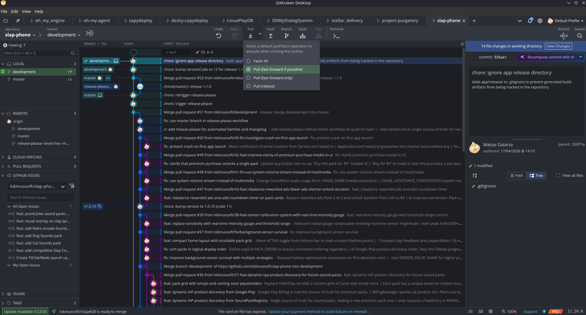
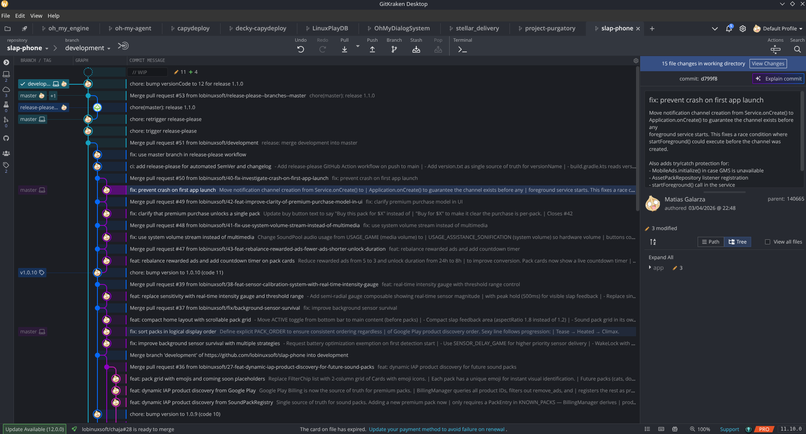
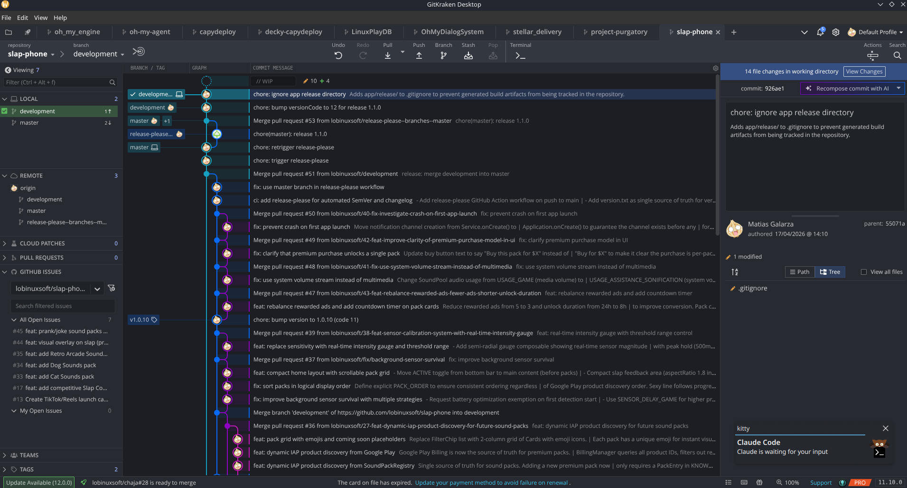
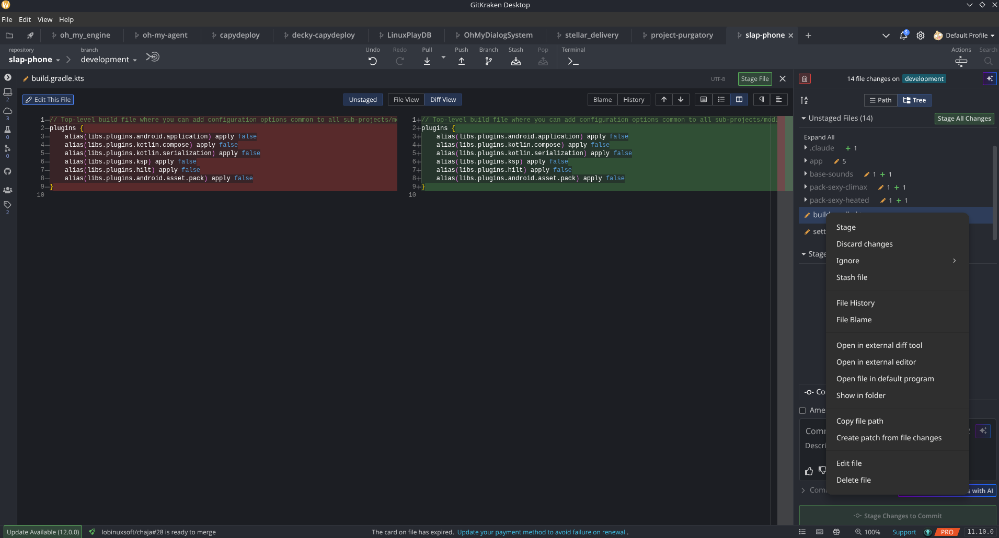
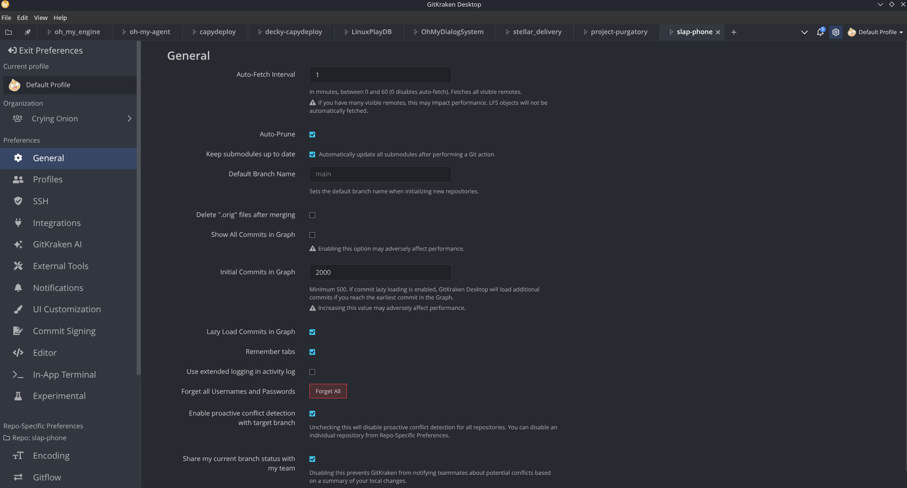
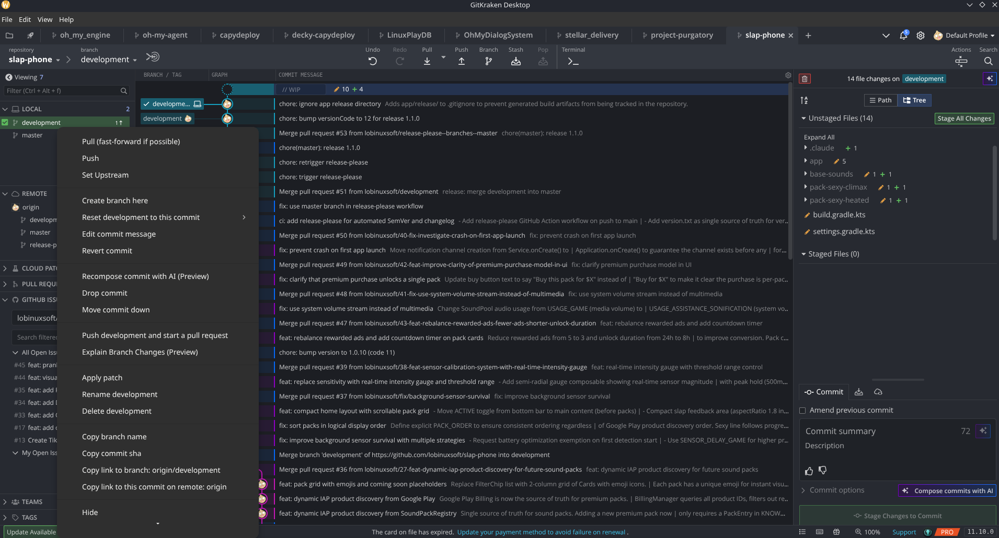
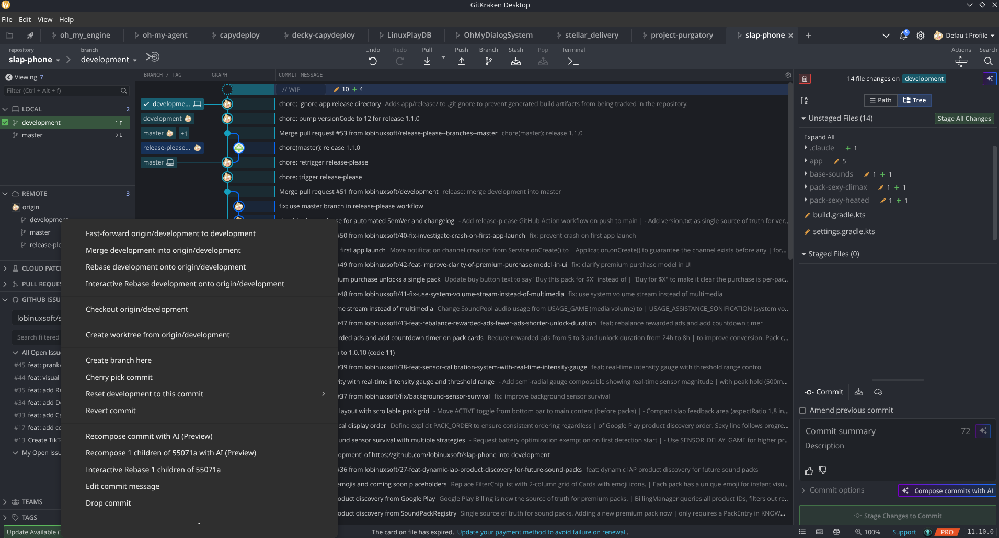
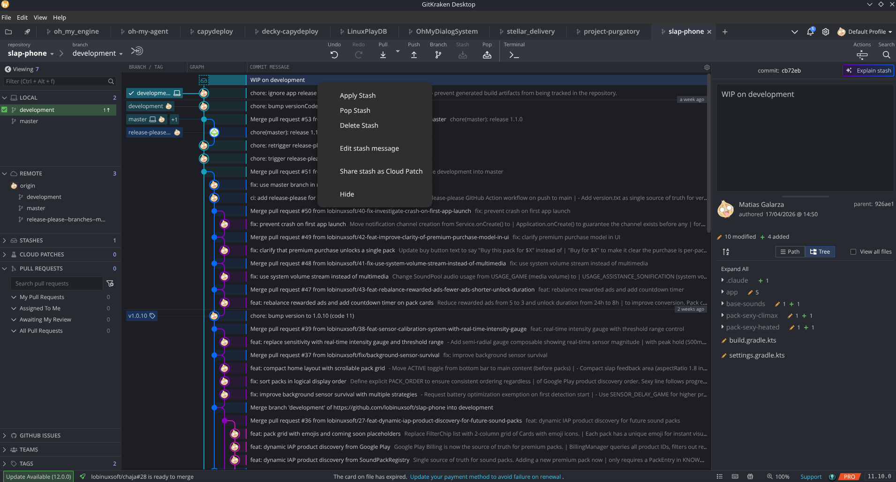
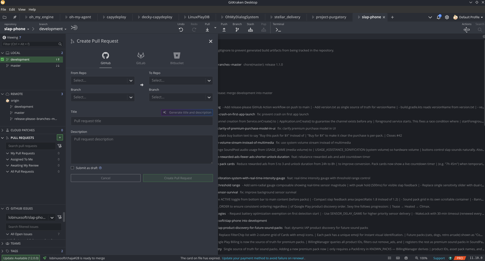

<!-- SPDX-License-Identifier: AGPL-3.0-or-later -->

# Yryvu UX reference

> **Read this first — what this document is and is NOT.**
>
> Yryvu's product scope is **all of Git, exposed through user-friendly UX**.
> Not "all of GitKraken". GitKraken Desktop 11.10.0 is studied here because it
> is currently the best-executed UX in the market for a Git client — so it
> serves as our **inspiration source** for layout, interaction, and visual
> patterns. It is **not** a paridad checklist.
>
> **Decision rules when planning a feature:**
> - Git supports it → we expose it with good UX, regardless of whether GitKraken
>   does (e.g. `bisect`, `reflog` browser, `worktree` first-class, `notes`,
>   patch series via `format-patch`/`am`, etc.).
> - GitKraken does it but it is not Git-native (Cloud Patches, AI features,
>   PRO licensing, marketing) → we skip it; see [§12](#12-features-not-cloned).
> - Git supports it AND GitKraken hides or under-exposes it → we surface it
>   better than GitKraken does.
> - Git supports it AND GitKraken nails it → we follow GitKraken's pattern as
>   far as it makes sense; this doc captures those patterns.
>
> So treat the section below as a **vocabulary of proven UX** for the
> Git operations we already plan to ship — not as the product's outer boundary.

This document captures layout, components, menus, shortcuts, and interaction
patterns observed from a set of user-captured screenshots on 2026-04-17, and
anchors them with stable section IDs so individual feature issues can point
here instead of duplicating the spec.

GitKraken itself is closed-source. Nothing here is copied from GitKraken's code;
the reference is strictly the observable UX of the public product. Open-source
peers we study for implementation hints are listed in [§9](#9-open-source-references).

> **Status (2026-04-17):** first pass of the audit. Some states were viewed during
> the session but not preserved to disk; those are marked ⚠ in the figure captions
> and need re-capture in a follow-up. Yryvu-side implementation status is tracked
> per-feature in the GitHub issue tracker; [§11](#11-issue-mapping) cross-references
> each spec section against its owning issue.

---

## Table of contents

- [1. Overview](#1-overview)
- [2. Global structure](#2-global-structure)
  - [2.1 Native menu bar](#21-native-menu-bar)
  - [2.2 Tab bar](#22-tab-bar)
  - [2.3 Repo toolbar](#23-repo-toolbar)
  - [2.4 Left sidebar](#24-left-sidebar)
  - [2.5 Main area](#25-main-area)
  - [2.6 Right panel (inspector)](#26-right-panel-inspector)
  - [2.7 Status bar](#27-status-bar)
- [3. Screens and modes](#3-screens-and-modes)
  - [3.1 Cold start / new tab](#31-cold-start--new-tab)
  - [3.2 Graph view (repo open)](#32-graph-view-repo-open)
  - [3.3 Diff viewer](#33-diff-viewer)
  - [3.4 Preferences window](#34-preferences-window)
- [4. Context menus](#4-context-menus)
  - [4.1 Commit context](#41-commit-context)
  - [4.2 Local branch context](#42-local-branch-context)
  - [4.3 Remote branch context](#43-remote-branch-context)
  - [4.4 Unstaged file context](#44-unstaged-file-context)
  - [4.5 Stash context](#45-stash-context)
- [5. Dialogs](#5-dialogs)
  - [5.1 Create Pull Request](#51-create-pull-request)
  - [5.2 Open Repo (native)](#52-open-repo-native)
- [6. Keyboard shortcuts](#6-keyboard-shortcuts)
- [7. Interaction patterns](#7-interaction-patterns)
- [8. Theming](#8-theming)
- [9. Open-source references](#9-open-source-references)
- [10. Component inventory](#10-component-inventory)
- [11. Issue mapping](#11-issue-mapping)
- [12. Features NOT cloned](#12-features-not-cloned)
- [13. Still to capture](#13-still-to-capture)

---

## 1. Overview

Yryvu is a cross-platform Git client built with Tauri 2, Rust, and SolidJS. Its
target UX is an exact clone of GitKraken Desktop's layout and interaction model,
so that users of GitKraken can switch without relearning. The open-source angle
is a second-class benefit; the first-class goal is UX parity.

This doc is the contract between the layout observed in GitKraken and the
implementation in Yryvu. Any deviation (because GitKraken's implementation is
paid, proprietary, or requires a cloud service we don't have) is called out
explicitly in [§12](#12-features-not-cloned).

---

## 2. Global structure

### 2.1 Native menu bar

Top of the application window, native per-platform. Four top-level submenus:
**File**, **Edit**, **View**, **Help**.

The full entries and their accelerators live in [§6](#6-keyboard-shortcuts).

### 2.2 Tab bar

Below the menu bar. Browser-model multi-repo: each open repository is a tab, so
a user can work across several repos simultaneously without juggling windows.

Anatomy, left to right:
- Two small icon buttons (folder picker, favorites/star) separated by a divider.
- The tab strip itself. Each tab shows: small icon + repo name + close `X`.
  Active tab has a subtle top-edge highlight.
- At the end of the strip: `+` button to open a New Tab (the cold-start screen).
- A `∨` dropdown that opens a **Search Tabs** flyout listing every open tab with
  a fuzzy search input and per-tab close button. This is **not** the command
  palette — it only searches open tabs.
- Far right (fixed): notifications bell (badge-counted), settings gear,
  **profile selector** (avatar + profile name dropdown).

### 2.3 Repo toolbar

Below the tab bar. Labelled icon buttons in a single horizontal strip.

Left side:
- `repository` caption + repo-name dropdown. Opens the repository switcher.
- Right-arrow separator.
- `branch` caption + current-branch dropdown. Opens the branch switcher.
- A small sync glyph (fetch status indicator).

Right side, in order: **Undo, Redo, Pull, Push, Branch, Stash, Pop, Terminal, Actions, Search**.

Each button is icon-above-label, square-ish. Hover and disabled states are
distinct.

The **Pull** button is a **split button**: its main face executes a
pre-configured default (fetch all / pull fast-forward if possible / pull
fast-forward only / pull rebase), and the `∨` caret on its right edge opens a
**default-selector** (radio buttons). Changing the selection changes what the
main face does from then on — it is **not** a one-shot action menu. See
[§7](#7-interaction-patterns).

### 2.4 Left sidebar

Vertical collapsible section list. Each section has a disclosure caret, a
title, and a right-aligned count badge.

Persistent sections (always visible):
- **Local** — local branches. Active branch is highlighted (green tint +
  checkmark). Branches with non-zero ahead/behind counts display `N↑` / `N↓`.
- **Remote** — expandable remote entries (`origin`, …) each with its tracked
  branches.
- **Cloud Patches** — GitKraken-proprietary; for us this is a placeholder or
  removed entirely (see [§12](#12-features-not-cloned)).
- **Pull Requests** — count badge plus a `+` affordance to create a new PR.
  Contains: search input, filter icon, and four sub-filters (My, Assigned to
  me, Awaiting my review, All) each with its own count.
- **GitHub Issues** — repository/org selector, filter, issue list with counts.
- **Teams** — collaborative features; largely out of scope for Yryvu.

Conditional sections (appear only when applicable state exists):
- **Stashes** — visible only when at least one stash exists. See
  [§4.5](#45-stash-context).
- **Submodules** (expected pattern; not yet captured).
- **Worktrees** (expected pattern; not yet captured).

Above the sections: a **Filter** input (`Ctrl+Alt+F`) and a "Viewing N"
counter.

The sidebar can **collapse** to a narrow icon rail (~44 px). In that mode each
section is represented by a single icon with its count badge; the filter, item
lists, and add buttons are hidden. The main area reclaims the horizontal space.
See [§7](#7-interaction-patterns).

**Resizability.** The sidebar's right edge is a drag handle (`col-resize`
cursor on hover). Width is clamped between **44 px** (collapsed-rail floor)
and the viewport ceiling minus the inspector width and a 480 px main-area
reservation, so the sidebar can never push the graph off-screen. The chosen
width persists per-profile in `preferences.json` under
`layout.leftSidebar.width`, alongside the open/closed flag at
`layout.leftSidebar.open`. Default width on first run is **215 px**
(verbatim from GK's `RefPanel: { width: 215, … }` profile literal — audit
doc `docs/research/gitkraken-left-panel/00-overview.md`).

### 2.5 Main area

Three-column tabular list of commits with lane rendering in the middle column:

| Column | Content |
|---|---|
| **Branch / Tag** | Ref pills (rounded rectangles) coloured per the lane they sit on. Each pill shows the ref name (truncated) plus tiny type glyphs (computer = local, origin = remote, avatar = PR). |
| **Graph** | Vertical lanes with coloured edges; nodes are filled circles with a small concentric highlight. Merge commits render with doubled circles. |
| **Commit message** | Short title in primary text, then a gap, then the body-preview in muted secondary text (single-line truncated). |

Age groupings (`2 days ago`, `3 days ago`, `2 weeks ago`, …) float as
separators between bands of commits, not per row.

Above the list, a `Viewing N` counter reflects visible/total commits plus a
gear icon for per-column settings.

Working-directory changes are represented as a **// WIP** row at the top of the
list, showing modified/added counters.

### 2.6 Right panel (inspector)

Stacked-section layout — **not** a modal switcher. Sections may be present
simultaneously.

Sections, top to bottom:

1. **WIP banner** — appears when the working directory is dirty. Text:
   `N file changes in working directory` (or `on <branch>` when in full staging
   mode). Right-aligned `View Changes` button jumps the panel into full
   staging mode.
2. **Commit details** — shown when a commit is selected. Contains the commit
   hash header, commit title, body, author (avatar + date), committer (icon +
   date), parents (clickable short-hash chips), changed-files summary
   (`N modified + M added`), Path/Tree toggle, expand-all control, and the file
   tree with per-file edit glyphs and hunk counts.
3. **Staging mode** — replaces 1+2 when `View Changes` is clicked. Contains:
   `N file changes on <branch>` heading, Path/Tree toggle, Unstaged Files
   section with Stage All Changes button, Staged Files section, and a commit
   form (Amend checkbox, title (72-char soft limit), description, commit
   options, action button). We omit the "Compose commits with AI" button.

**Resizability.** The panel's left edge is a drag handle (`col-resize`
cursor on hover). Width is clamped between **353 px** (GK's verbatim
`BOTTOM_DETAIL_PANEL_MIN_HEIGHT` floor, applied here as the min-width
constant) and the viewport ceiling minus the left sidebar width and a
480 px main-area reservation. The chosen width persists per-profile in
`preferences.json` under `layout.detailPanel.width`. The panel's
open/closed flag (`layout.detailPanel.open`) is bound to **`Cmd/Ctrl+K`**.
The panel hides entirely (the grid cell collapses, no empty placeholder)
when no commit is selected and the working tree is clean — see audit doc
`docs/research/gitkraken-right-panel/01-panel-chrome.md`.

Default width on first run is **400 px**, height **386 px** (drag handle
for height deferred — current shell grid spans the row vertically; a
top-edge handle requires a bottom-anchor refactor tracked separately).

### 2.7 Status bar

Narrow persistent strip at the bottom of the window. Segments:
- **Left:** repo name, update-available indicator, per-repo actionable notices
  (e.g. "PR is ready to merge").
- **Center:** product-level message slot (we leave empty).
- **Right:** activity/notifications glyphs, zoom percentage, license badge,
  version number.

---

## 3. Screens and modes

### 3.1 Cold start / new tab

Rendered when the active tab has no repo bound to it (fresh app, after closing
all repos, or clicking `+` in the tab bar).

Two-column page, sidebar stays visible but is empty-stated:

- **Left column — Repositories**
  - Heading
  - Action triad: `[Open]`, `[Clone]`, `[Create]`.
  - `Recent` heading
  - List of recent repos: name (accent colour) + absolute path (mono, muted).
- **Right column — Resources**
  - We replace GitKraken's "Connect More Integrations" upsell with our own
    quick-links (Documentation, Keyboard shortcuts, Release notes).

### 3.2 Graph view (repo open)

The main area described in [§2.5](#25-main-area). This is the screen the user
will spend almost all their time in.

### 3.3 Diff viewer

Shown in the main area when a file is selected — either from the commit details
tree (historical diff) or from the staging Unstaged/Staged lists (working-dir
diff).

Layout:
- **Header row**: file path breadcrumb, `UTF-8` encoding chip, `Stage File`
  action, close `X`.
- **Toolbar row**, left to right:
  - `Edit This File` (opens in external editor).
  - `Unstaged` toggle (selects which version of the file to view).
  - `File View` / `Diff View` switch.
  - `Blame`, `History`, up/down nav arrows to step through hunks.
  - Five layout icons: line numbers, detail view, side-by-side (default),
    column/align, whitespace marker (`¶`).
- **Panes**: old on the left (red tint on removed lines), new on the right
  (green tint on added lines). Line numbers per pane. Tokens within changed
  lines are highlighted in a stronger shade; context lines use a softer tint.

### 3.4 Preferences window

Full-window overlay that replaces the main/sidebar/inspector trio but keeps the
tab bar. Two-column layout:

Left — categories sidebar:
- `← Exit Preferences` button at top.
- **Current profile** (expandable).
- **Organization** (expandable).
- **Preferences** section (global):
  General, Profiles, SSH, Integrations, External Tools, Notifications,
  UI Customization, Commit Signing, Editor, In-App Terminal, Experimental.
  (GitKraken AI is intentionally omitted from our clone.)
- **Repo-Specific Preferences** section: per-repo overrides (Encoding, Gitflow).

Right — form for the selected category. General (reference) exposes:
Auto-Fetch Interval, Auto-Prune, Keep submodules up to date, Default Branch
Name, Delete `.orig` files after merging, Show All Commits in Graph,
Initial Commits in Graph (min 500), Lazy Load Commits in Graph,
Remember tabs, Use extended logging, Forget all Usernames and Passwords,
Enable proactive conflict detection with target branch, Share branch status
with team.

---

## 4. Context menus

GitKraken uses **different** context menus depending on the target, and some
are state-aware. Yryvu must dispatch by target type and, where applicable,
branch tracking state.

### 4.1 Commit context

Triggered by right-clicking a commit node in the graph. Entries (separators
rendered as `---`):

- Pull (fast-forward if possible), Push, Set Upstream
- ---
- Checkout ▸
- Create worktree from ▸
- ---
- Create branch here
- Reset `<branch>` to this commit ▸ (soft / mixed / hard)
- Edit commit message
- Revert commit
- ---
- Drop commit
- ---
- Start a pull request to origin from origin/`<branch>`
- ---
- Apply patch
- Rename `<branch>`
- Delete `<branch>`
- Delete origin/`<branch>`
- Delete `<branch>` and origin/`<branch>`
- ---
- Copy branch name
- Copy commit sha
- (scrolls for more)

The branch-ops at the bottom appear because the right-clicked commit is the
tip of a branch; on commits that are not branch tips, those entries are hidden.

We **omit** GitKraken's "Recompose commit with AI", "Explain Branch Changes",
and any other `(Preview)` AI entries.

### 4.2 Local branch context

Triggered by right-clicking a branch row in the LOCAL sidebar section. The menu
is **state-aware** — entries change depending on the branch's tracking state
(ahead/behind/untracked/diverged).

Common core:
- Pull (fast-forward if possible), Push, Set Upstream
- ---
- Create branch here
- Reset `<branch>` to this commit ▸
- Edit commit message
- Revert commit
- ---
- Drop commit
- ---
- Start a pull request to origin from origin/`<branch>` *(or)*
  Push `<branch>` and start a pull request *(when ahead of origin)*
- ---
- Apply patch
- Rename `<branch>`
- Delete `<branch>`
- ---
- Copy branch name, Copy commit sha
- Copy link to branch: origin/`<branch>`
- Copy link to this commit on remote: origin
- ---
- Hide (hide from sidebar)
- Pin to Left

State-dependent additions observed:
- When ahead by ≥1: **Move commit down** appears (reorder the tip commit
  backward; mini-rebase), and the PR entry is prefixed with "Push …".

### 4.3 Remote branch context

Triggered by right-clicking a ref in the REMOTE sidebar (e.g.
`origin/development`). Cross-ref operations between the current local branch
and the clicked remote ref:

- Fast-forward origin/`<branch>` to `<branch>`
- Merge `<branch>` into origin/`<branch>`
- Rebase `<branch>` onto origin/`<branch>`
- Interactive Rebase `<branch>` onto origin/`<branch>`
- ---
- Checkout origin/`<branch>` (detached-head)
- ---
- Create worktree from origin/`<branch>`
- ---
- Create branch here
- Cherry pick commit
- Reset `<branch>` to this commit ▸
- Revert commit
- ---
- Interactive Rebase N children of `<hash>`
- Edit commit message
- Drop commit
- (scrolls for more)

Implication: the menu for a remote ref is **not** just a copy of the local
branch menu; it exposes operations that take both refs as arguments.

### 4.4 Unstaged file context

Triggered by right-clicking a file in the Unstaged Files list of the staging
panel. Per-file verbs only — no branch or commit ops.

- Stage
- Discard changes
- Ignore ▸ (submenu: this file, by extension, by directory — inferred)
- Stash file (stash this single file)
- ---
- File History
- File Blame
- ---
- Open in external diff tool
- Open in external editor
- Open file in default program
- Show in folder
- ---
- Copy file path
- Create patch from file changes (single-file `.patch`)
- ---
- Edit file
- Delete file

A **staged** file context menu is expected to be the same scaffold with
`Stage → Unstage` and `Discard changes → Reset changes` swapped (not yet
captured). A **committed** file context menu (from the commit details tree) is
expected to expose view-only verbs (History, Blame, Open in external editor,
Copy path). Both need capture to confirm.

### 4.5 Stash context

Stashes surface in three places simultaneously:
- a dedicated row in the graph, with a distinct stash glyph and title
  `WIP on <branch>`;
- a conditional **Stashes** section in the sidebar (count badge);
- when selected, the right panel treats the stash like a commit (hash, parent,
  modified/added summary, file tree).

Context menu (right-click on a stash row):
- Apply Stash
- Pop Stash (apply + remove)
- Delete Stash
- ---
- Edit stash message
- ---
- Hide (hide visually in graph; entry stays in the sidebar)

The toolbar `Stash` and `Pop` icons are one-click shortcuts for creating a new
stash and popping the latest, respectively — complementary to per-stash ops in
this menu.

---

## 5. Dialogs

### 5.1 Create Pull Request

Triggered by the `+` button beside the PULL REQUESTS sidebar section title.
Rendered **inline in the main area** — the sidebar stays visible, so this is
not a modal over the whole window.

Layout:
- Header: `Create Pull Request` title + close `X`.
- Platform switcher (tabs): **GitHub** (default), **GitLab**, **Bitbucket**.
  Multi-forge from the first iteration.
- Two side-by-side dropdown pairs:
  - **From Repo → To Repo** (supports fork → upstream PRs).
  - **Branch → Branch** (source on the left, target on the right).
- **Title** field, with a "Generate title and description" AI action (omitted
  in Yryvu).
- **Description** textarea.
- **Submit as draft** checkbox with help tooltip `?`.
- Action buttons: `[Cancel]` and `[Create Pull Request]` (primary, disabled
  until required fields are filled).

Per-platform body fields are swapped by the tab selector. Implement once,
branch the fields.

### 5.2 Open Repo (native)

Native folder picker (Tauri `plugin-dialog`). Not a custom dialog. Triggered by
the File ▸ Open Repo… menu entry, `Ctrl+O`, the folder icon in the tab bar,
the Cold Start `[Open]` button, or the repo-name dropdown in the toolbar when
empty.

---

## 6. Keyboard shortcuts

All shortcuts are literal from GitKraken Desktop 11.10.0, reproduced here as
the Yryvu target. `Cmd` on macOS, `Ctrl` on Windows/Linux.

### File
| Shortcut | Action |
|---|---|
| Ctrl+T | New Tab |
| Ctrl+W | Close Tab |
| Ctrl+Shift+T | Reopen Closed Tab |
| Ctrl+N | Clone Repo… |
| Ctrl+I | Init Repo… |
| Ctrl+O | Open Repo… |
| Alt+Ctrl+O | Open Repo Management |
| Ctrl+Shift+E | Open Repo in External Editor |
| Alt+T | Open External Terminal |
| Alt+O | Open in File Manager |
| Ctrl+, | Preferences… |
| Ctrl+Q | Quit |

### Edit
Standard: Undo/Redo/Cut/Copy/Paste/Select All (Ctrl+Z/Y/X/C/V/A).

### View
| Shortcut | Action |
|---|---|
| Ctrl+Shift+R | Relaunch |
| Ctrl+Shift+F | Toggle Full Screen |
| Ctrl+J | Show Left Panel (toggle) |
| Ctrl+K | Show Commit Details Panel (toggle) |
| Ctrl+\` | Show Terminal Panel (toggle) |

### Help
| Shortcut | Action |
|---|---|
| Ctrl+P | Open Command Palette |
| Ctrl+/ | Keyboard Shortcuts reference |

### In-panel
| Shortcut | Action |
|---|---|
| Ctrl+Alt+F | Focus sidebar Filter |

> Note: GitKraken's Command Palette is `Ctrl+P`, **not** `Ctrl+Shift+P` as in
> VS Code. Keep the shortcut consistent with GitKraken for muscle-memory parity.

---

## 7. Interaction patterns

### Split-button default-selector
Buttons like `Pull` in the repo toolbar are **not** action menus. The main face
runs the **pre-configured default** action, and the `∨` caret opens a radio-
button selector that changes the default itself. The selection persists across
sessions. See [figure 22](assets/gk/22-pull-split-button-default-selector.png).

### Conditional sidebar sections
Sidebar sections are added or removed based on repository state. `Stashes`
appears only when at least one stash exists. Same pattern is expected for
`Submodules` (only if `.gitmodules` is present) and `Worktrees` (only if more
than the main worktree exists). Implementation-wise, each section declares a
`visibleWhen(repoState)` predicate.

### State-aware context menus
Context menus are not static: their entries depend on the state of the target
ref. Branches ahead of their upstream get a `Move commit down` entry and a
`Push <branch> and start a pull request` entry instead of the plain
`Start a pull request…`. Implement menu builders as pure functions of state.

### Right-panel stacked layout
The inspector is a **stack** of optional sections, not a modal switcher.
`WIP banner → Commit details` is a common combination when the workdir is dirty
and a commit is selected. Clicking `View Changes` on the banner collapses to a
pure staging view.

### Drag-first interactive rebase
GitKraken's primary trigger for interactive rebase is dragging a commit onto
another with `Ctrl+Shift` held, not a menu item. The `Interactive Rebase …`
menu entries exist but often require an already-selected drop target to
execute. Our implementation may diverge here by offering a discoverable
button-triggered modal as the primary path, preserving drag-to-rebase for
parity.

### Inline dialogs (not modal-over-everything)
Dialogs like Create Pull Request render inline in the main area, leaving the
sidebar visible. Reserve true OS modals for native dialogs (file pickers,
native confirms).

### Tab model = browser
Multiple repos can be open simultaneously, each as a tab. Tab-switching
preserves panel state per tab.

---

## 8. Theming

Yryvu's CSS is token-driven. All colour values flow through
`:root[data-theme="dark|light"]` blocks, and the current theme is applied by
setting `data-theme` on `document.documentElement` from a persisted SolidJS
signal. Dark is the default.

New themes (user-custom or vendor) add another `[data-theme="…"]` block. No
component CSS should hardcode colours. See the tokens in
`apps/yryvu-app/src/App.css`.

Out of scope for this doc: the **selector UI** for switching themes lives in
issue [#27](https://github.com/lobinuxsoft/yryvu/issues/27).

---

## 9. Open-source references

GitKraken Desktop is closed-source. We do not read, decompile, or mirror its
code. For implementation hints we study these public projects:

| Project | License | Why |
|---|---|---|
| [GitLens](https://github.com/gitkraken/vscode-gitlens) (VS Code) | MIT | Best modern TS/JS reference for a commit graph renderer and inline blame. |
| [Gitg](https://gitlab.gnome.org/GNOME/gitg) (GNOME) | GPL-2.0 | Classic 3-pane layout reference (sidebar / graph / diff). |
| [GitUI](https://github.com/extrawurst/gitui) (Rust) | MIT | Rust-side command architecture and keybinding model. |
| [git-graph](https://github.com/mlange-42/git-graph) (Rust) | MIT | Lane-assignment algorithm we already study for `graph-core`. |
| [gitoxide](https://github.com/Byron/gitoxide) | Apache-2.0/MIT | Our primary Git engine; its book and examples guide rev-walk and storage use. |

Not referenced:
- **Sublime Merge** — closed-source.
- **Fork** — closed-source.

---

## 10. Component inventory

Running list of the distinct UI components the layout requires. Not
exhaustive; updated as new ones surface.

**Shell-level**
- `AppShell` (CSS grid with regions) ✅ #29
- `TabBar` (with search-tabs dropdown and profile selector) — partial #29
- `RepoToolbar` (with split-button default-selector) — partial #29
- `LeftSidebar` (with collapsible sections and icon-rail mode) — partial #29
- `MainArea` (hosts children; currently the graph) ✅ #29
- `RightPanelStack` (WIP banner + commit details + staging modes) — partial #29
- `StatusBar` ✅ #29

**Graph**
- `CommitGraphRenderer` (WebGL) ✅ #1 (nodes render bug still open)
- `BranchTagPill` (column 1) — pending
- `LaneEdges` (WebGL inside `CommitGraphRenderer`) ✅ partial

**Sidebar**
- `SidebarSection` (collapsible with badge) ✅ #29
- `BranchListItem` — pending #5
- `PullRequestListItem` — pending #15/16/17
- `IssueListItem` — pending #15/16/17

**Right panel**
- `WipBanner` ✅ #29 (stub, dirty count always 0)
- `CommitDetails` — pending #6 and follow-ups
- `StagingPanel` (Unstaged + Staged + CommitForm) — pending #2
- `FileTree` (shared by commit details and staging) — pending

**Diff**
- `DiffViewer` (side-by-side / inline) — pending #6
- `DiffHeader` (breadcrumb + Stage File + encoding) — pending #6
- `DiffToolbar` (Edit/Unstaged/File/Diff/Blame/History/…) — pending #6

**Dialogs**
- `CreatePrDialog` (multi-forge tab switcher) — pending #15/16/17
- Native file picker ✅ (`@tauri-apps/plugin-dialog`)

**Menus**
- Native menu bar ✅ #29
- Five context-menu dispatchers (commit/local-branch/remote-branch/file/stash)
  — pending
- Command Palette — pending #14

**Primitives**
- `SplitButton` (default-selector pattern) — pending
- `DropdownButton` — pending
- `DataBadge` (count pill) ✅ #29 (inline CSS)

**Empty states**
- `ColdStart` ✅ #29

---

## 11. Issue mapping

This table cross-references spec sections to the GitHub issues that implement
them. Columns:
- **§** — spec section.
- **Issue** — owning issue.
- **Status** — `done` (merged), `in-progress`, `open` (not started).

| § | Area | Issue | Status |
|---|---|---|---|
| [§2.1 Native menu bar](#21-native-menu-bar) | Shell | [#29](https://github.com/lobinuxsoft/yryvu/issues/29) | done |
| [§2.2 Tab bar](#22-tab-bar) | Shell | [#29](https://github.com/lobinuxsoft/yryvu/issues/29) (partial — multi-tab pending) | open (follow-up) |
| [§2.3 Repo toolbar](#23-repo-toolbar) | Shell | [#29](https://github.com/lobinuxsoft/yryvu/issues/29) (stubs) + [#4](https://github.com/lobinuxsoft/yryvu/issues/4) (Pull/Push impl) | done / open |
| [§2.4 Left sidebar](#24-left-sidebar) | Shell + branches | [#29](https://github.com/lobinuxsoft/yryvu/issues/29) + [#5](https://github.com/lobinuxsoft/yryvu/issues/5) | done / open |
| [§2.5 Main area](#25-main-area) | Graph | [#1](https://github.com/lobinuxsoft/yryvu/issues/1) | done (node-render bug open) |
| [§2.6 Right panel](#26-right-panel-inspector) | Details + staging | [#29](https://github.com/lobinuxsoft/yryvu/issues/29) (stack) + [#2](https://github.com/lobinuxsoft/yryvu/issues/2) (staging) + [#6](https://github.com/lobinuxsoft/yryvu/issues/6) (diff) | done / open |
| [§2.7 Status bar](#27-status-bar) | Shell | [#29](https://github.com/lobinuxsoft/yryvu/issues/29) | done |
| [§3.1 Cold start](#31-cold-start--new-tab) | Shell | [#29](https://github.com/lobinuxsoft/yryvu/issues/29) | done |
| [§3.3 Diff viewer](#33-diff-viewer) | Diff | [#6](https://github.com/lobinuxsoft/yryvu/issues/6) | open |
| [§3.4 Preferences](#34-preferences-window) | Settings | future | open |
| [§4.1 Commit context menu](#41-commit-context) | Commit | [#3](https://github.com/lobinuxsoft/yryvu/issues/3) + follow-ups | open |
| [§4.2 Local branch context](#42-local-branch-context) | Branches | [#5](https://github.com/lobinuxsoft/yryvu/issues/5) | open |
| [§4.3 Remote branch context](#43-remote-branch-context) | Branches | [#5](https://github.com/lobinuxsoft/yryvu/issues/5) | open |
| [§4.4 Unstaged file context](#44-unstaged-file-context) | Staging | [#2](https://github.com/lobinuxsoft/yryvu/issues/2) | open |
| [§4.5 Stash context](#45-stash-context) | Stash | [#12](https://github.com/lobinuxsoft/yryvu/issues/12) | open |
| [§5.1 Create PR dialog](#51-create-pull-request) | PR | [#15](https://github.com/lobinuxsoft/yryvu/issues/15) + [#16](https://github.com/lobinuxsoft/yryvu/issues/16) + [#17](https://github.com/lobinuxsoft/yryvu/issues/17) | open |
| [§6 Keyboard shortcuts](#6-keyboard-shortcuts) | Shell | [#29](https://github.com/lobinuxsoft/yryvu/issues/29) | done |
| [§7 Split-button pattern](#7-interaction-patterns) | Primitives | part of owning feature issues | open |
| [§8 Theming](#8-theming) | Tokens | infra [#29](https://github.com/lobinuxsoft/yryvu/issues/29) + selector [#27](https://github.com/lobinuxsoft/yryvu/issues/27) | done / open |

When a feature issue is picked up, its PR body should link back to the
relevant spec section using the anchor, e.g.
`See docs/ui-reference.md § 4.2 Local branch context`.

---

## 12. Features NOT cloned

We intentionally skip:

- **AI features**: "Explain commit", "Explain Branch Changes (Preview)",
  "Recompose commit with AI (Preview)", "Compose commits with AI",
  "Generate title and description" in PR creation. These depend on
  GitKraken's paid cloud. Our roadmap has no AI equivalent.
- **Cloud Patches**: GitKraken-proprietary patch-sharing. Issue
  [#26](https://github.com/lobinuxsoft/yryvu/issues/26) tracks a low-priority
  alternative.
- **Integrations upsell panel** on cold start ("Connect More Integrations").
  We replace it with a local Resources panel.
- **PRO license badge** and renewal/card-on-file notifications in the status
  bar. Yryvu ships under AGPL; the badge reads `OSS`.
- **Follow-us-on-Twitter** and marketing entries in the Help menu.
- **Support Logs submenu** in Help (GitKraken-specific telemetry pipeline).

---

## 13. Still to capture

Physical screenshots missing from `docs/assets/gk/` that would enrich this
reference. Listed in priority order:

- Interactive rebase UI (the screen that opens after dropping a commit with
  `Ctrl+Shift`).
- 3-way merge conflict resolver.
- Repository switcher dropdown, open.
- Branch switcher dropdown, open.
- Pull request detail view (after clicking a PR in the sidebar list).
- Staged file context menu.
- Committed file context menu (from the commit-details tree).
- Commit context menu scrolled past "Copy commit sha" to reveal the remaining
  entries.
- Submenu expansions: `Checkout ▸`, `Reset to this commit ▸`, `Create worktree from ▸`,
  `Ignore ▸`.
- Command Palette with a typed query (to observe ranking / categories).

These don't block any current issue — the observations in §§2-5 cover the
broad strokes and implementation can begin. Re-capture when next working in
GitKraken.
